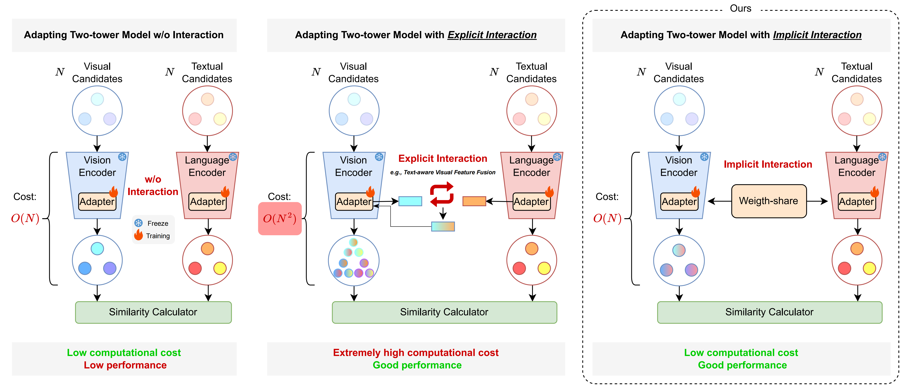
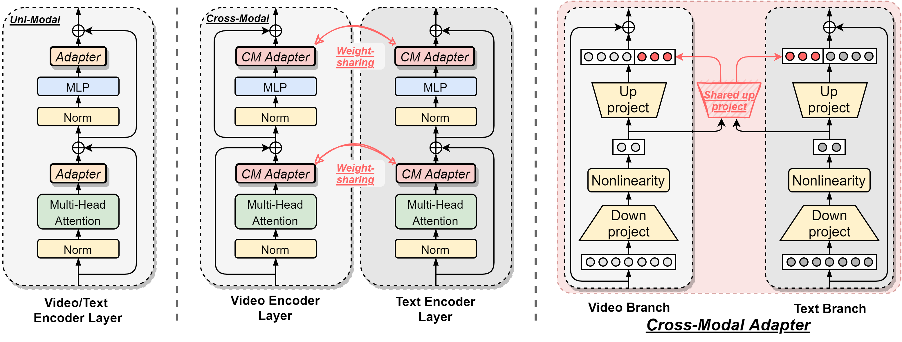
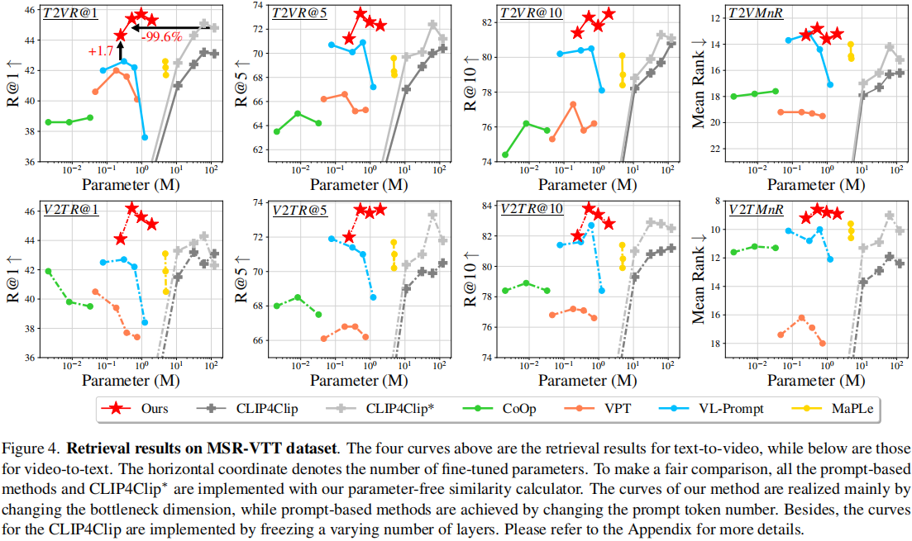
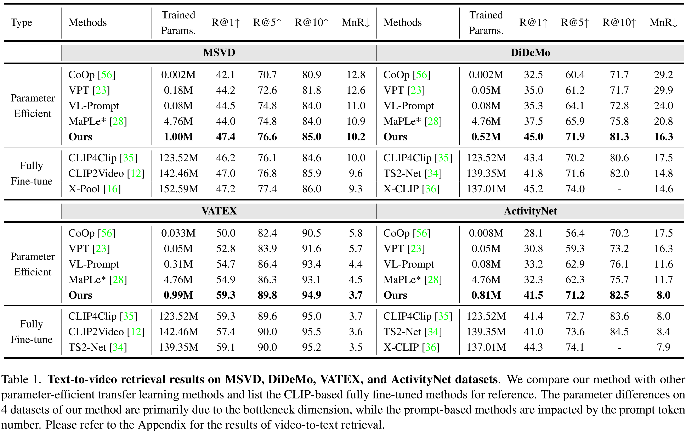
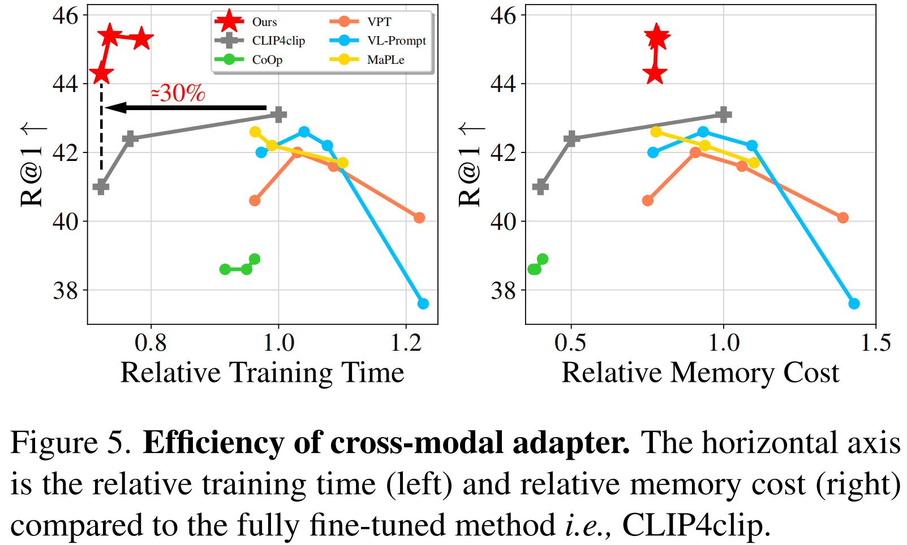
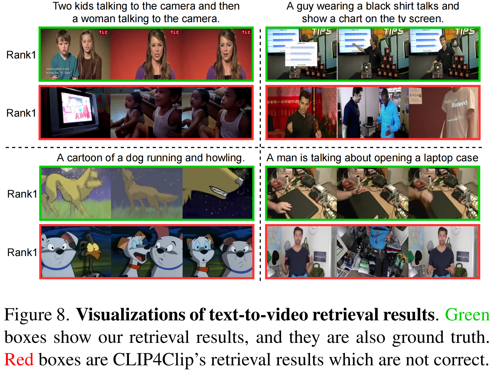

# Cross-Modal-Adapter

  

This repository wiil be the official Pytorch implementation for Cross-Modal Adapter. 

> Title: [**Cross-Modal Adapter for Text-Video Retrieval**](https://arxiv.org/abs/2211.09623)  
> Authors: [Haojun Jiang](https://scholar.google.com/citations?user=ULmStp8AAAAJ&hl=en), Jianke Zhang, [Rui Huang](https://scholar.google.com/citations?user=ieN4b1QAAAAJ&hl=en&oi=sra), [Chunjiang Ge](https://scholar.google.com/citations?user=ZueTF6oAAAAJ&hl=en&oi=ao), [Zanlin Ni](https://scholar.google.com/citations?user=Yibz_asAAAAJ&hl=en&oi=ao), [Jiwen Lu](https://scholar.google.com/citations?user=TN8uDQoAAAAJ&hl=en&oi=ao), [Jie Zhou](https://scholar.google.com/citations?user=6a79aPwAAAAJ&hl=en&oi=ao), [Shiji Song](https://scholar.google.com/citations?user=rw6vWdcAAAAJ&hl=en&oi=ao), [Gao Huang](https://scholar.google.com/citations?user=-P9LwcgAAAAJ&hl=en&oi=ao)  
> Title: [**Cross-Modal Adapter for Text-Video Retrieval**](https://arxiv.org/abs/2211.09623),  
> Authors: [Haojun Jiang](https://scholar.google.com/citations?user=ULmStp8AAAAJ&hl=en), Jianke Zhang, [Rui Huang](https://scholar.google.com/citations?user=ieN4b1QAAAAJ&hl=en&oi=sra), [Chunjiang Ge](https://scholar.google.com/citations?user=ZueTF6oAAAAJ&hl=en&oi=ao), [Zanlin Ni](https://scholar.google.com/citations?user=Yibz_asAAAAJ&hl=en&oi=ao), [Jiwen Lu](https://scholar.google.com/citations?user=TN8uDQoAAAAJ&hl=en&oi=ao), [Jie Zhou](https://scholar.google.com/citations?user=6a79aPwAAAAJ&hl=en&oi=ao), [Shiji Song](https://scholar.google.com/citations?user=rw6vWdcAAAAJ&hl=en&oi=ao), [Gao Huang](https://scholar.google.com/citations?user=-P9LwcgAAAAJ&hl=en&oi=ao).  
> Publication: *arXiv preprint ([arXiv 2211.09623](https://arxiv.org/abs/2211.09623))*  

<!-- 
## BibTex

    @article{ma2022rethinking,
        title={Rethinking network design and local geometry in point cloud: A simple residual MLP framework},
        author={Ma, Xu and Qin, Can and You, Haoxuan and Ran, Haoxi and Fu, Yun},
        journal={arXiv preprint arXiv:2202.07123},
        year={2022}
    }
 -->

## Overview
In this paper, we present a novel Cross-Modal Adapter for parameter-efficient fine-tuning. Although surprisingly simple, our approach has three notable benefits: (1) reduces 99.6% of fine-tuned parameters, and alleviates the problem of overfitting, (2) saves approximately 30% of training time, and (3) allows all the pre-trained parameters to be fixed, enabling the pre-trained model to be shared across datasets.

  

## Results
**1. Text2video and video2text retrieval resutls on MSR-VTT.**

  

**2. Text2video and video2text retrieval resutls on MSVD, VATEX, DiDeMo, and ActivityNet.**

  

**3. Training and memory efficiency.**

  

**4. Visualizations.**

  

## Acknowledgment
Our implementation is mainly based on the following codebases. We gratefully thank the authors for their wonderful works.
- [CLIP4Clip](https://github.com/ArrowLuo/CLIP4Clip): An Empirical Study of CLIP for End to End Video Clip Retrieval.
- [hyperformer](https://github.com/rabeehk/hyperformer): Parameter-efficient Multi-task Fine-tuning for Transformers via Shared Hypernetworks.
