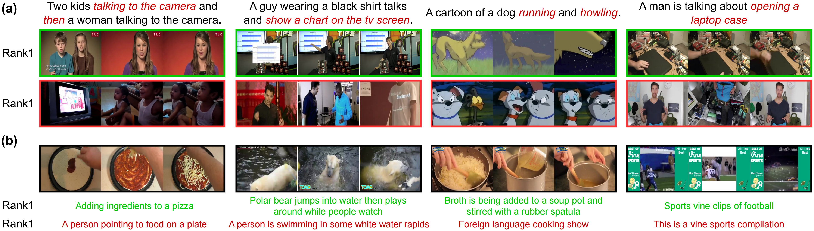

# Cross-Modal Adapter
<p align="center">  </p>

This repository will be the official Pytorch implementation for Cross-Modal Adapter. 

> **Title**:&emsp;&emsp; **Cross-Modal Adapter for Vision-Language Retrieval**  
> **Authors**:&nbsp;&nbsp;[Haojun Jiang](https://scholar.google.com/citations?user=ULmStp8AAAAJ&hl=en), [Jianke Zhang](https://scholar.google.com/citations?user=6is33pIAAAAJ&hl=en&oi=ao), [Rui Huang](https://scholar.google.com/citations?user=ieN4b1QAAAAJ&hl=en&oi=sra), [Chunjiang Ge](https://scholar.google.com/citations?user=ZueTF6oAAAAJ&hl=en&oi=ao), [Zanlin Ni](https://scholar.google.com/citations?user=Yibz_asAAAAJ&hl=en&oi=ao), [Shiji Song](https://scholar.google.com/citations?user=rw6vWdcAAAAJ&hl=en&oi=ao), [Gao Huang](https://scholar.google.com/citations?user=-P9LwcgAAAAJ&hl=en&oi=ao)  
> **Institute**: Tsinghua University and Beijing Institute of Technology  
> **Publish**:&nbsp;&nbsp;&nbsp;**Pattern Recognition 2025 (IF=7.6)** [[Paper Link](https://www.sciencedirect.com/science/article/pii/S0031320324008951)]  
> **Contact**:&nbsp;&nbsp;jianghaojunthu at 163 dot com / jhj20 at mails dot tsinghua dot edu dot cn

<!-- 
## BibTex

    @article{ma2022rethinking,
        title={Rethinking network design and local geometry in point cloud: A simple residual MLP framework},
        author={Ma, Xu and Qin, Can and You, Haoxuan and Ran, Haoxi and Fu, Yun},
        journal={arXiv preprint arXiv:2202.07123},
        year={2022}
    }
 -->

## Overview
In this paper, we present a novel Cross-Modal Adapter for parameter-efficient fine-tuning. Although surprisingly simple, our approach has three notable benefits: (1) reduces the vast majority of fine-tuned parameters, (2) saves training time, and (3) allows all the pre-trained parameters to be fixed, enabling the pre-trained model to be shared across datasets.

<p align="center">  </p>
<p align="center"> Fig. 2. Overview of the Cross-Modal Adapter. Left is the scheme that naively plugs independent uni-modal adapters into the vision and language encoders. Note that there is no
cross-modal interaction. Middle is our cross-modal adapter which enables encoder-level cross-modal interaction via a weight-sharing mechanism. Right is the implementation details
of our cross-modal adapter.
</p>

## Usage

- **Training Command**

    ```bash
    python -m torch.distributed.launch --nproc_per_node=4 --master_port 35888 train.py --workers 8 
           --epochs=5 --batch_size=128 --datatype msrvtt --anno_path ./dataset/MSR-VTT/anns 
           --features_path ./dataset/MSR-VTT/images/fps_1 --max_frames 12 --loose_type 
           --pretrained_clip_name ViT-B/32 --dataset_type img --clip_lr 1e-7 --lr 1e-5 
           --output_dir ./logs/ --adapter_reduction_dims 8  --adapter_share_dim 16 
           --adapter_init_std 0.01 --adapter_non_linearity quick_gelu --seed 42 
           --adapter_convert2fp16
    ```

- **Core Module**

  The core adapter module is implemented in MetaLayersUpshareAdapterController class (defined in [adapter_controller.py](modules/adapter_controller.py)). This component is invoked by the main model in [module_clip_jointvt_upshare_adapter.py](modules/module_clip_jointvt_upshare_adapter.py) (Lines 354-377).

- **Key Parameters**

    | Parameter                 | Description                     | Value/Type     | Paper Reference |
    |---------------------------|---------------------------------|----------------|-----------------|
    | `adapter_reduction_dims`  | Bottleneck dimension            | User-defined   | *r*             |
    | `adapter_share_dim`       | Weight-sharing dimension        | User-defined   | *dₛ*            |
    | `adapter_non_linearity`   | Activation function             | `gelu`         | -               |
 
- **Initialization Note**

  Adapter parameters are initialized using: $\mathcal{N}(0, 0.01)$.
  Important: Smaller std deviation (*e.g.*, <0.01) may lead to slower convergence. The paper recommends the 0.01 initialization scale for optimal training dynamics.

## Visualizations
<p align="center">  </p>
<p align="center"> Fig. 5. Visualizations results. Green boxes show the rank-1 correct retrieval results of our method. Red boxes are baseline’s wrong retrieval results. </p>

<p align="center">  </p>
<p align="center">
Fig. 6. Visualizations of model’s attention on frames. We highlight discriminative feature in both text and images.
</p>

## Reference

If you find our project useful in your research, please consider citing:

```
@article{jiang2025cross,
  title={Cross-modal adapter for vision--language retrieval},
  author={Jiang, Haojun and Zhang, Jianke and Huang, Rui and Ge, Chunjiang and Ni, Zanlin and Song, Shiji and Huang, Gao},
  journal={Pattern Recognition},
  volume={159},
  pages={111144},
  year={2025},
  publisher={Elsevier}
}
```

## Acknowledgment
Our implementation is mainly based on the following codebases. We gratefully thank the authors for their wonderful works.
- [CLIP4Clip](https://github.com/ArrowLuo/CLIP4Clip): An Empirical Study of CLIP for End to End Video Clip Retrieval.
- [HyperFormer](https://github.com/rabeehk/hyperformer): Parameter-efficient Multi-task Fine-tuning for Transformers via Shared Hypernetworks.
